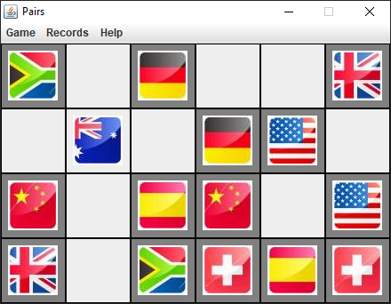

# Pairs
All the items are in pairs. Objective of the game is to match the pairs by clicking on them one after the other. Matched pairs will be marked with a coloured border and will be kept visible.

This is how the Fruits version of the game looks in action:  

Best times feature:  

This is how the Flags version of the game looks in action:  

